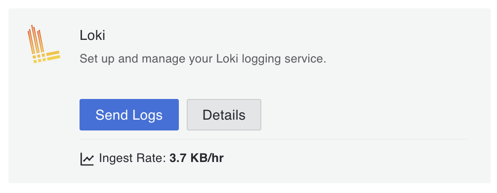
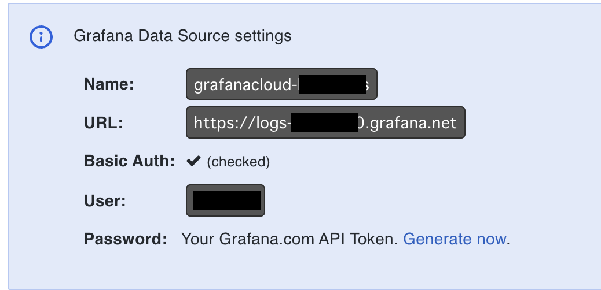

# cloki - Zero Dependency and Simple Logging Library from Cloudflare Workers to Grafana Cloud's Loki

[](https://www.npmjs.com/package/@miketako3/cloki)
[](https://github.com/miketako3/cloki/blob/main/LICENSE)
[](https://github.com/miketako3/cloki/actions/workflows/release.yaml)
[](https://github.com/miketako3/cloki/releases)
[](https://github.com/miketako3/cloki/commits/main)
[](https://github.com/miketako3/cloki/graphs/contributors)
[](https://www.npmjs.com/package/@miketako3/cloki)

## Introduction

Welcome to **cloki**, an open-source logger designed to bridge [Cloudflare Workers](https://www.cloudflare.com/developer-platform/workers/) with [Grafana Cloud's Loki](https://grafana.com/products/cloud/logs/) seamlessly and efficiently. Targeted at individual developers, cloki aims to reduce maintenance costs while offering a straightforward logging solution. With minimal configuration and the sole use of the fetch API, cloki is an easy-to-implement tool for effective logging.

## Features

- **Easy Integration**: Connect Cloudflare Workers with Grafana Cloud's Loki effortlessly.
- **Minimal Configuration**: Get started with just a few simple settings.
- **Zero Dependencies**: cloki has zero dependencies, making it easy to maintain.
- **Fetch API Usage**: cloki uses the Fetch API, so it can be used in any environment like edge runtime.

## Installation

```shell
$ npm i @miketako3/cloki
```

## Grafana Cloud Setup

1. Create a Grafana Cloud account from [here](https://grafana.com/).
2. Access https://grafana.com/orgs/${YOUR_ORG_NAME}
3. Click Detail. 
4. You got the required information. 

## Usage

```typescript
import {Cloki} from '@miketako3/cloki'

const logger = getLokiLogger({
  lokiHost: "Host URL (e.g. logs-xxx-yyy.grafana.net)",
  lokiUser: "User (e.g. 123456)",
  lokiToken: "Generated API Token"
});

await logger.info({message: "Hello World!"});

await logger.error({message: "Hello World!", error: error});

// with addional labels
await logger.info({message: "Hello World!"}, {foo: "bar"});
```

### Advanced Usage

#### 1. Default Labels and Minimum Log Level

You can set default labels that will be added to every log, and specify a minimum log level.

```typescript
const logger = getLokiLogger({
  lokiHost: "...",
  lokiUser: "...",
  lokiToken: "...",
  defaultLabels: { env: "production", app: "my-service" },
  minLevel: "info" // 'debug' | 'info' | 'warn' | 'error'
});
```

#### 2. String Messages

You can pass a string directly as a message. It will be converted to `{"message": "your string"}`.

```typescript
await logger.info("Hello World!");
```

#### 3. Cloudflare Workers `ctx.waitUntil` and `cf` properties

To prevent the log sending from being cancelled when the worker returns a response, you can pass the `ExecutionContext` to `getLokiLogger` or to each log method. You can also automatically add labels from `request.cf`.

```typescript
export default {
  async fetch(request, env, ctx) {
    const logger = getLokiLogger({ 
      cf: request.cf, // Automatically add cf_colo, cf_country, etc.
      ctx: ctx // Use ctx.waitUntil internally for all logs
    });
    
    // This will use ctx.waitUntil internally and won't block the response
    logger.info("Request received", { path: new URL(request.url).pathname });
    
    return new Response("OK");
  }
}
```

#### 4. Zero Configuration (Environment Variables)

If you set the following environment variables, you can initialize the logger without any arguments:

- `LOKI_HOST` (e.g., `logs-prod-us-central1.grafana.net`)
- `LOKI_USER`
- `LOKI_TOKEN`

Standard usage for Cloudflare Workers:

```typescript
export default {
  async fetch(request, env, ctx) {
    const logger = getLokiLogger({ cf: request.cf, ctx });
    // ...
  }
}
```

#### 5. Retries and Error Handling

You can configure retries and a callback for when sending fails.

```typescript
const logger = getLokiLogger({
  retries: 3,
  onSendError: (err, msg) => {
    console.error("Failed to send to Loki after retries", err);
  }
});
```

#### 6. Custom Formatter and Silent Mode

```typescript
const logger = getLokiLogger({
  silent: process.env.NODE_ENV === 'development',
  format: (level, msg, labels) => {
    // Return custom LokiMessage structure
    return {
      streams: [{
        stream: { ...labels, level, custom: 'label' },
        values: [[Date.now().toString() + "000000", JSON.stringify(msg)]]
      }]
    };
  }
});
```

#### 7. Request Auto Extraction and Trace IDs

You can automatically extract labels like `http_method`, `http_url`, `trace_id` (from `CF-Ray`), and `request_id` (from `X-Request-ID`) by passing the `Request` object.

```typescript
const logger = getLokiLogger({ 
  request: request // Default request for all logs
});

// Or pass it in a specific log
await logger.info({ message: "API called", request: request });
```

#### 8. Function Wrapper (AOP Style)

You can measure execution time and log it automatically using the `wrap` method.

```typescript
const wrappedFetch = logger.wrap("external-api", async (url) => {
  return await fetch(url);
});

const response = await wrappedFetch("https://example.com");
// This will automatically log: Function external-api executed with duration_ms
```

#### 9. Development Environment (Pretty Print)

When `NODE_ENV` or `WORKER_ENV` is set to `development` (or `dev`), or `silent: true` is set, `cloki` will output colorized and formatted logs to the console for better readability.

#### 10. TypeScript Type Safety for Labels

You can define the allowed label keys using Generics.

```typescript
type MyLabels = 'env' | 'service' | 'version';
const logger = getLokiLogger<MyLabels>({
  defaultLabels: { env: 'prod' } // Type checked
});

await logger.info("Hello", { service: 'api' }); // Type checked
// await logger.info("Hello", { unknown: 'label' }); // TypeScript Error
```

## Contributing

Contributions are what make the open-source community such an amazing place to learn, inspire, and create. Any contributions you make are greatly appreciated.

- Fork the Project
- Create your Feature Branch (git checkout -b feature/AmazingFeature)
- Commit your Changes (git commit -m 'Add some AmazingFeature')
- Push to the Branch (git push origin feature/AmazingFeature)
- Open a Pull Request

## License

Distributed under the MIT License. See **LICENSE** for more information.

## Contacts

miketako3 (Kaito Hiruta) - contact@miketako.xyz

Project Link: https://github.com/miketako3/cloki
